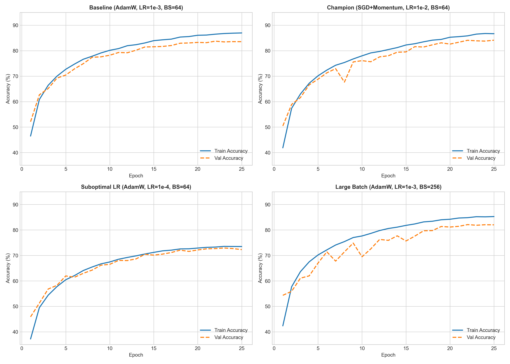
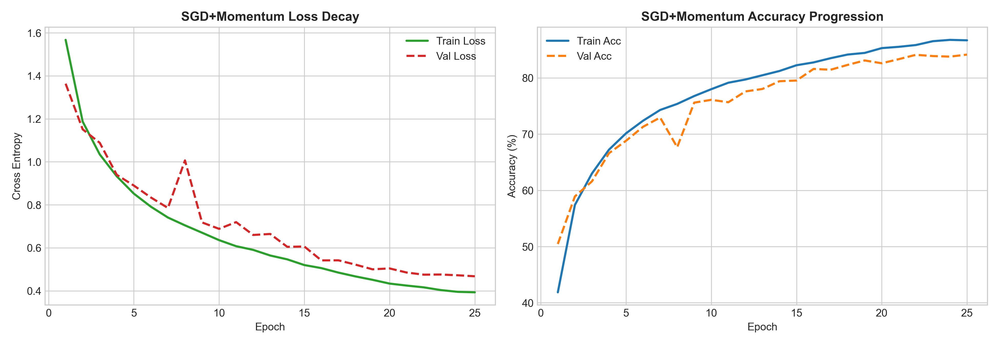
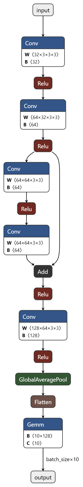
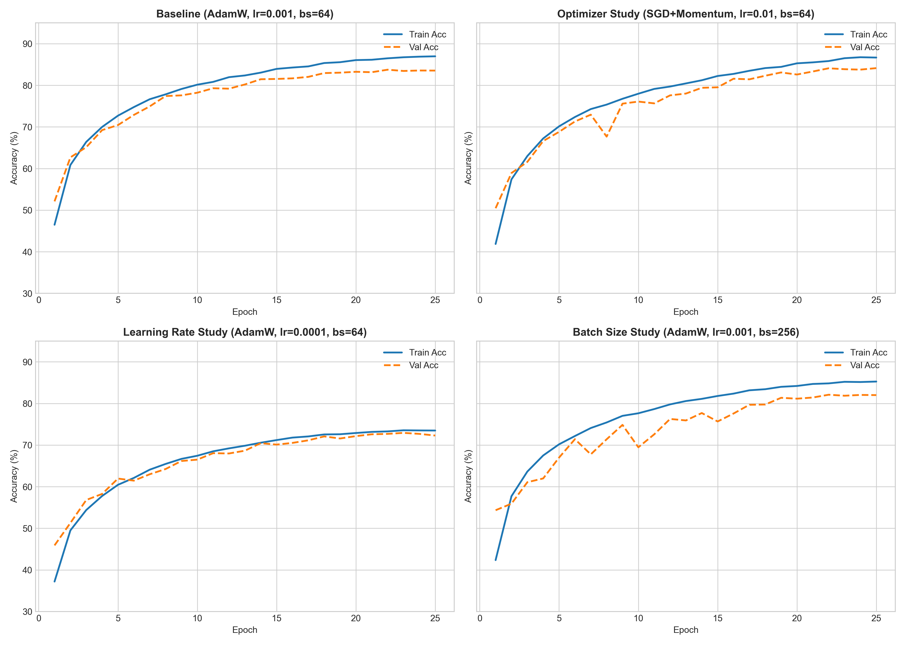
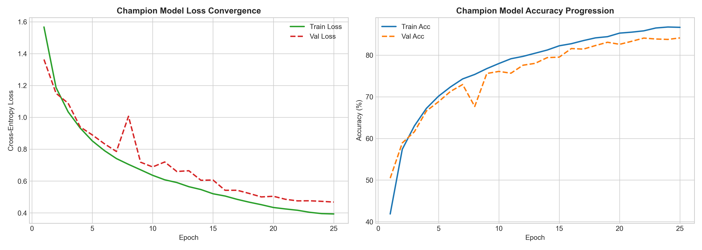

# CIFAR-10 Mini-ResNet

A compact deep-learning project for training, evaluating, exporting, quantizing, and deploying a CIFAR-10 image classifier. The project contains:

- A PyTorch training pipeline with data augmentation and experiment logging.
- A seven-stage Mini-ResNet designed for the CIFAR-10 input size of `3 x 32 x 32`.
- Hyperparameter experiments covering optimizer, learning rate, and batch size.
- FP32 and dynamically quantized INT8 ONNX models for CPU inference.
- A Streamlit application backed by ONNX Runtime.
- Bare-metal export assets for a C++ inference implementation, including raw weights, reference tensors, and a model manifest.

## Visual Snapshot

The project results and model structure are visible here before the detailed setup and implementation notes.

### Mini-ResNet architecture

<p align="center">
  
</p>

### Experiment convergence

<p align="center">
  
</p>

### Champion model curves

<p align="center">
  
</p>

### Exported ONNX graph

<p align="center">
  
</p>

### Accuracy comparison

<p align="center">
  
</p>

### Champion training curves

<p align="center">
  
</p>

## Results at a Glance

The strongest recorded experiment is the SGD + momentum configuration:

| Experiment        | Optimizer             | Learning rate | Batch size | Peak validation accuracy |   Macro F1 |
| ----------------- | --------------------- | ------------: | ---------: | -----------------------: | ---------: |
| Baseline          | AdamW                 |        `1e-3` |         64 |                   83.75% |     0.8370 |
| **Champion**      | **SGD, momentum 0.9** |    **`1e-2`** |     **64** |               **84.13%** | **0.8410** |
| Low learning rate | AdamW                 |        `1e-4` |         64 |                   72.93% |     0.7283 |
| Large batch       | AdamW                 |        `1e-3` |        256 |                   82.10% |     0.8206 |

The complete generated comparison is available in [`artifacts/EXPERIMENT_SUMMARY.md`](artifacts/EXPERIMENT_SUMMARY.md).

## Model Architecture

`MiniResNet` accepts a normalized CIFAR-10 image and produces logits for 10 classes:

```text
Input: 3 x 32 x 32
  -> Stem: Conv 3x3, 3 -> 32, BatchNorm, ReLU
  -> Downsample 1: Conv 3x3, stride 2, 32 -> 64, BatchNorm, ReLU
  -> Residual block: Conv 64 -> 64, BatchNorm, ReLU, Conv 64 -> 64, BatchNorm, skip add, ReLU
  -> Downsample 2: Conv 3x3, stride 2, 64 -> 128, BatchNorm, ReLU
  -> Global average pooling: 8 x 8 -> 1 x 1
  -> Flatten
  -> Linear classifier: 128 -> 10
  -> Class logits
```

The network keeps the spatial tensors small and uses global average pooling instead of a large fully connected feature map. The exported model input is `[batch, 3, 32, 32]`; the ONNX batch dimension is dynamic.

### CIFAR-10 labels

The output order used by the Streamlit application is:

`Airplane`, `Automobile`, `Bird`, `Cat`, `Deer`, `Dog`, `Frog`, `Horse`, `Ship`, `Truck`.

## Repository Layout

```text
.
├── app.py                         Streamlit ONNX inference application
├── requirements.txt               Python dependencies
├── src/
│   ├── model.py                   Mini-ResNet definition
│   ├── dataset.py                 CIFAR-10 loading, augmentation, normalization
│   ├── train.py                   Training, validation, checkpoints, histories
│   ├── benchmark.py               PyTorch and ONNX CPU latency benchmark
│   ├── export_onnx.py             PyTorch checkpoint -> ONNX FP32
│   ├── quantize.py                ONNX dynamic INT8 quantization
│   ├── dump_weights.py            Flat binary weight and manifest export
│   ├── export_assignment2.py      C++/bare-metal assets and references
│   ├── plot_curves.py              Training-curve generation
│   ├── generate_report_visuals.py Report figure generation
│   └── generate_summary.py         Experiment summary generation
├── artifacts/                     Checkpoints, histories, ONNX files, plots, reports
├── cpp_engine/                    Model config, raw weights, inputs, references
├── data/                           CIFAR-10 files used by torchvision
├── maketable/                      Table-generation utility
└── DL Assignment 1 Report.*       Assignment report source and PDF
```

## Setup

Python 3.10 or newer is recommended. A CPU-only environment is sufficient for inference and smoke testing; CUDA can be used automatically by the training script when PyTorch detects it.

### Windows PowerShell

```powershell
py -m venv .venv
.\.venv\Scripts\Activate.ps1
python -m pip install --upgrade pip
python -m pip install -r requirements.txt
python -m pip install streamlit pillow
```

The extra install provides the Streamlit UI dependency and makes the image upload dependency explicit. The training loader downloads CIFAR-10 automatically when the dataset is not already available locally.

## Quick Start

### Verify the model

```powershell
python -m src.model
```

This creates a dummy batch, checks the output shape `[4, 10]`, and prints the number of trainable parameters.

### Run a one-epoch smoke test

```powershell
python -m src.train
```

The smoke test uses AdamW, learning rate `0.001`, batch size `128`, and one epoch. It writes `artifacts/local_smoke_test_best.pt` and `artifacts/local_smoke_test_history.json`.

### Train an experiment

`src.train.run_experiment` is the main training API. For example:

```powershell
python -c "from src.train import run_experiment; run_experiment(exp_name='my_experiment', optimizer_type='SGD_Momentum', lr=0.01, batch_size=64, epochs=15)"
```

Supported optimizer names are `AdamW`, `Adam`, `SGD_Momentum`, and `SGD_Vanilla`. Each run stores the best validation checkpoint as `<name>_best.pt` and its metric history as `<name>_history.json` in `artifacts/`.

### Regenerate tables and plots

```powershell
python -m src.generate_summary
python -m src.plot_curves
python -m src.generate_report_visuals
```

These commands regenerate the experiment summary, training curves, and report figures from the history JSON files already in `artifacts/`.

## Export and Deployment

### Export the champion checkpoint to ONNX

The default export uses `artifacts/optimizer_sgd_momentum_best.pt`:

```powershell
python -m src.export_onnx
```

Output: `artifacts/cifar10_miniresnet.onnx` using ONNX opset 13, constant folding, and a dynamic batch dimension.

### Create the dynamic INT8 model

```powershell
python -m src.quantize
```

Output: `artifacts/cifar10_miniresnet_int8.onnx`. The quantizer uses ONNX Runtime dynamic quantization with `QUInt8` weights.

### Benchmark CPU inference

```powershell
python -m src.benchmark
```

The benchmark compares PyTorch eager FP32, ONNX Runtime FP32, and ONNX Runtime INT8 when the INT8 file exists. It reports mean, P50, and P99 latency over warmed-up runs. Results depend on the host CPU and system load, so benchmark output should be recorded with the machine details.

### Run the Streamlit application

```powershell
streamlit run app.py
```

The app loads `artifacts/cifar10_miniresnet.onnx` with the ONNX Runtime CPU execution provider. Uploaded JPEG or PNG images are converted to RGB, resized to `32 x 32`, converted from HWC to CHW, normalized with the CIFAR-10 mean and standard deviation, and scored. The UI displays the top prediction, confidence, measured inference latency, and top-three probabilities.

The model was trained on CIFAR-10 images, so predictions on ordinary high-resolution photographs may be unreliable even though the app accepts common image formats.

## Bare-Metal / C++ Export

To regenerate the assignment's raw binary assets from the champion PyTorch checkpoint:

```powershell
python -m src.export_assignment2
```

This populates `cpp_engine/` with:

- `configs/model_config.json`: layer order, tensor dimensions, attributes, and file references.
- `data/input/sample_input.bin`: deterministic FP32 input generated with seed 42.
- `data/weights/*.bin`: FP32 convolution, BatchNorm, and classifier parameters.
- `data/reference/*.bin`: layer-by-layer outputs, logits, and probabilities for validation.

For a flat serialization of the complete PyTorch `state_dict`, run:

```powershell
python -m src.dump_weights
```

This writes `artifacts/bare_metal/model_weights.bin` and `artifacts/bare_metal/weights_manifest.json`. The current repository contains the C++ engine data contract and reference assets, but no C++ source or build system; the files are ready to be consumed by a separate C++ runtime implementation.

## Preprocessing Contract

Training images use:

1. Random horizontal flip with probability `0.5`.
2. Four-pixel padding followed by a random `32 x 32` crop.
3. Conversion to a tensor in `[0, 1]`.
4. Channel-wise normalization:

```text
mean = (0.4914, 0.4822, 0.4465)
std  = (0.2470, 0.2435, 0.2616)
```

Validation and inference omit augmentation and retain only tensor conversion and normalization. The Streamlit app performs the equivalent preprocessing after resizing an uploaded image.

## Reproducibility Notes

- Training uses the CIFAR-10 train split of 50,000 images and evaluates on the 10,000-image test split through `torchvision.datasets.CIFAR10`.
- The training script does not set a global random seed, so retrained results can vary.
- Existing checkpoints and figures in `artifacts/` are preserved outputs from earlier runs and can be used to reproduce the reported plots without retraining.
- Relative paths assume commands are executed from the repository root.
- `src/evaluate.py` is currently empty; validation is implemented by `validate` inside `src/train.py`.

## License and Dataset

This repository does not currently include a project license file. CIFAR-10 is distributed by the University of Toronto under its own dataset terms. Review the applicable dataset terms before redistributing the data or trained artifacts.
